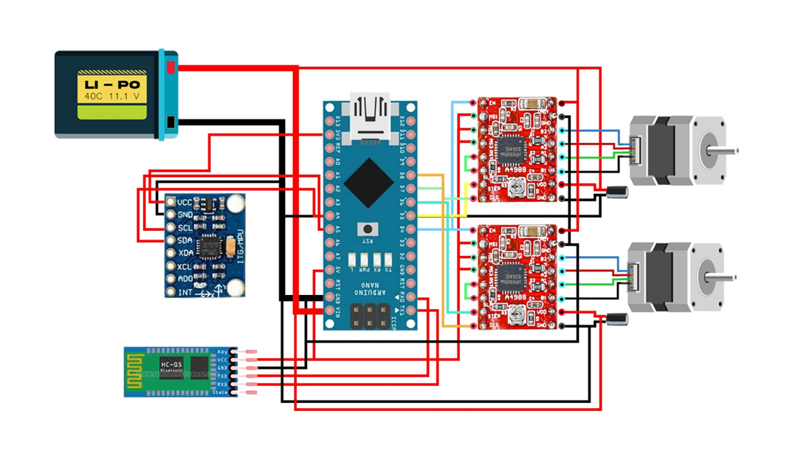

# Self Balancing Robot Arduino

## Parts List
1. Arduino NANO
2. MPU6050 Gyro Sensor
3. two NEMA 17 motors
4. two A4988 drivers
5. HC-05 Bluetooth module

## Circuit Diagram
<p align="center">
  
</p>
Make the connections as shown in the above circuit diagram. I have used a 6x8 cm universal PCB prototype board to solder out the connections.
<br /><br/>

**Note: Check for short circuits using DMM before mounting the hardware.**

Basic Connections:
|     PIN     |     PORT      |
| ------------- | ----------- |
| A4  |          SDA          |
| A5  |          SCL          |
| D5  | DIR for Left Motor    |
| D6  | STEP for Left Motor   |
| D7  | DIR for Right Motor   |
| D8  | STEP for Right Motor  |

## Programming
**NOTE:**

If your MPU6050 orientation is similar to me, keep the current axis to `PITCH` otherwise change it to `ROLL`.<br/>
BT module should be turned OFF before uploading the code.

### Install Libraries
1. Go to the libraries folder.
2. Copy and paste the MPU6050 folder into the Arduino library directory (e.g., `Documents\Arduino\libraries`)

### Calibrating the MPU6050
1. Navigate to the MPU6050 directory (e.g., `Documents\Arduino\libraries`).
2. Open the file `IMU_Zero.ino` located in `examples\IMU_Zero`.
3. Upload the file to your Arduino.
```
The line just above the "done" line will look something like
    [567,567] --> [-1,2]  [-2223,-2223] --> [0,1] [1131,1132] --> [16374,16404] [155,156] --> [-1,1]  [-25,-24] --> [0,3] [5,6] --> [0,4]
As will have been shown in interspersed header lines, the six groups making up this
line describe the optimum offsets for the X acceleration, Y acceleration, Z acceleration,
X gyro, Y gyro, and Z gyro, respectively.  In the sample shown just above, the trial showed
that +567 was the best offset for the X acceleration, -2223 was best for Y acceleration, 
and so on.
```
4. Save 6 values and update the config.h file accordingly.

```
int XGyro = 77;
int YGyro = -30;
int ZGyro = -13;
int XAccel = -2820;
int YAccel = 946;
int ZAccel = 976;
```
### Upload Program
Upload `self-balancing-robot.ino` to your Arduino

## Current state of the robot

## Dealing with Common Errors
Most of the common errors can be dealt with by checking the following:

* <b>Check the PIN numbers:</b> Make sure that the PIN numbers on (lines 26-31) match up with the ones you are using on your robot.
```
#define INTERRUPT_PIN 2
#define leftDirection       5
#define leftPulse           6
#define rightDirection      7
#define rightPulse          8
```
* <b>Update the MPU-6050 Offsets:</b> Each sensor has unique offset values, which have to be inputted on `config.h`. I explain how to find these offsets [here](https://github.com/robertlee903/self-balancing-robot?tab=readme-ov-file#calibrating-the-mpu6050).
* <b>Ensure sensor is working properly:</b> Check that the MPU-6050 is working, by uncommenting (line 228) of my code. While running, the robot should display the current angle on the console. When held upright, the angle should be 0. When pitching forwards/backwards, the number should be positive/negative in degrees.
* <b>Motors balance in wrong direction:</b> Instead of stopping the robot from falling, the motors speed up the fall. This means that both motors are wired in backwards!

**This finally concludes my tutorial about self-balancing robot!**